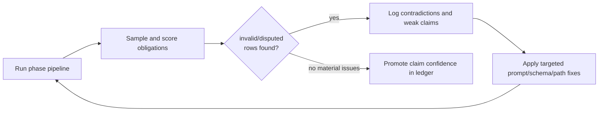

# The Trustworthiness Gap in LLM Protocol Verification

**Subtitle:** Why auditability improved faster than correctness in Ethereum EIP mapping

_Research Working Note Draft (Merged v2.1)_

---

## Abstract

Most LLM verification discussions start with capability: can the model generate plausible mappings? In protocol security, that is not the hard part. The hard part is trust calibration: deciding which mappings are reliable, which are disputed, and which are wrong without blowing up reviewer time.

Across the PoC artifacts in this repository, one pattern is clear. Structured phase boundaries improved replayability and auditability. They did not remove correctness errors, obligation disputes, or environment-sensitive interpretation risk. The strongest defensible conclusion is methodological: verification systems improve fastest when they optimize for falsifiability, contradiction handling, and claim confidence discipline, not for polished narrative output.

---

## Quick Evidence Snapshot (Scored Sample)

| Model | Rows | Avg Score (/10) | valid | partial | invalid | disputed |
|---|---:|---:|---:|---:|---:|---:|
| claude-haiku-4-5 | 49 | 3.5 | 2 | 7 | 39 | 1 |
| claude-opus-4-5 | 20 | 9.4 | 16 | 3 | 0 | 1 |
| claude-sonnet-4-5 | 12 | 9.0 | 11 | 0 | 0 | 1 |

- Total scored obligations: 81
- Overall labels: valid 29, partial 10, invalid 39, disputed 3
- Composition: 47 direct-adjudication rows + 34 compare-derived medium-confidence rows
- Source files: `docs/evaluations/sample_scored_run.csv`, `docs/evaluations/metrics_summary.md`

This is directional evidence, not a full benchmark. Compare-derived rows are conservative proxy scoring from cross-run alignment and should not be treated as a substitute for full manual adjudication.

Methods note:
1. Direct-adjudication rows are the strongest quality evidence.
2. Compare-derived rows are medium-confidence proxy scoring for trust-risk detection.
3. Compare-derived rows are not a substitute for full manual row adjudication.

---

## The Framing Error

The default question is:

> Can the model do the task?

The more useful question is:

> Can we trace, challenge, and falsify each claim with bounded effort?

That is the trustworthiness gap:

**The gap between what a pipeline can produce and what a reviewer can independently validate at acceptable cost.**

In this repository, contradictory artifacts make the gap concrete. Some outputs describe near-complete compliance. Other artifacts on overlapping tasks document noisy client mappings, unstable obligation identity, and disputed requirement extraction. Both sets of artifacts are polished. They cannot all be equally correct.

This is why evidence governance, not output fluency, is the controlling problem.

---

## What the System Actually Is

The implementation under study is the phase pipeline packaged in PoC 5:

`extract -> locate-spec -> analyze-spec -> locate-client -> analyze-client`

Primary references:
- `poc5/docs/POC_IMPLEMENTATION_SPEC.md:58`
- `poc5/docs/POC_IMPLEMENTATION_SPEC.md:62`
- `poc5/docs/POC_IMPLEMENTATION_SPEC.md:67`

The key design win is not magical accuracy. It is artifact lineage. Each phase leaves inspectable outputs, which lets reviewers localize disagreement instead of arguing from summaries.

---

## Evidence Discipline (Non-Negotiable)

This essay uses a strict hierarchy:

1. Tier 1: raw run artifacts (CSV outputs, manifests, prompts, model outputs)
2. Tier 2: validation/evaluation documents with row-level checks
3. Tier 3: narrative summaries and retrospective prose

When tiers conflict, Tier 1/2 win. This prevents confidence language from overruling contradictory row-level evidence.

Supporting files:
- `docs/evaluations/sources.md`
- `docs/evaluations/evidence_ledger.md`
- `docs/evaluations/contradictions.csv`

---

## Contradictions You Cannot Ignore

| ID | Conflict | Practical resolution |
|---|---|---|
| CTR-001 | Narrative "full compliance" vs noisy row-level mappings | Treat narrative as context; quality claims must follow spot-check evidence |
| CTR-002 | Sparse gap flags vs low mapping quality | Gap columns are model-reported concerns, not objective error rates |
| CTR-003 | OBL-030 treated as normal row vs later unsupported/questionable | Keep `disputed` status and exclude from strong compliance claims |
| CTR-004 | EIP-7702 "not implemented" vs "clean run" | Require environment metadata (client ref/context) with every claim |
| CTR-005 | 100% field population vs wrong mappings | Use completeness as process telemetry, never correctness evidence |

Source: `docs/evaluations/contradictions.csv`

If contradictions are not first-class workflow objects, teams will default to selective interpretation.

---

## What the Runs Show (and What They Don't)

### 1) Model differences are error-profile differences

Current evidence supports this statement more strongly than global model ranking.

- Haiku profile in sample evidence: heavier path noise and more invalid mappings.
- Opus/Sonnet profile in sample evidence: much stronger mapping quality, still with disputed obligations.

Anchors:
- `poc5/docs/QUALITATIVE_EVALUATION.md:35`
- `poc5/docs/QUALITATIVE_EVALUATION.md:39`
- `poc5/examples/qualitative_validation_transcript.md:132`
- `poc5/examples/qualitative_validation_transcript.md:252`
- `docs/evaluations/sample_scored_run.csv`

### 2) Obligation identity is unstable across reruns

Row IDs drift. Statement-level matching is required for meaningful comparison.

Anchors:
- `poc5/docs/QUALITATIVE_EVALUATION.md:26`
- `poc5/docs/QUALITATIVE_EVALUATION.md:34`
- `poc5/examples/qualitative_validation_transcript.md:62`

### 3) Completeness metrics can mask correctness failures

High field population is compatible with poor location quality.

Anchors:
- `poc5/examples/workflow_runs/21571909617/verification-report-7702/summary.md:51`
- `poc5/examples/qualitative_validation_transcript.md:137`

### 4) Some obligations are semantically disputed

OBL-030 is the cleanest case: mapping mechanics can look coherent while the requirement basis remains contested.

Anchors:
- `poc5/docs/QUALITATIVE_EVALUATION.md:40`
- `poc5/examples/qualitative_validation_transcript.md:246`
- `poc5/examples/qualitative_validation_transcript.md:307`

### 5) Environment context can invert interpretation

EIP-7702 examples show this directly: one run appears missing, another effectively clean, depending on context.

Anchors:
- `poc5/examples/workflow_runs/21570420032/verification-report-7702/summary.md:66`
- `poc5/examples/workflow_runs/21571909617/verification-report-7702/summary.md:66`
- `poc5/examples/README.md:30`

### What these findings do not prove

- system-wide precision/recall/F1
- hard architecture ceilings
- universal model ranking independent of environment and task mix

Boundary anchor:
- `poc5/docs/QUALITATIVE_EVALUATION.md:14`

---

## Negative Results Matter More Than Success Narratives

The abandoned/older paths are not side notes. They explain why the current shape survived.

### Approach class A: repo-map-heavy guided flows

Pattern observed: growing context breadth increased complexity and diagnosis cost without reliable per-obligation trust gains.

Anchors:
- `poc4/README.md`
- `poc4_5/README.md`
- `poc4_5/POC4_5_FLOW.md`

### Approach class B: exploratory spike architectures

Pattern observed: useful discovery power, weak comparability unless constrained by a single adjudication contract.

Anchor:
- `poc/docs/SPIKE.md`

### Approach class C: proposal-era rejection matrix

Pattern observed: directionally useful decisions, but evidence is fragmented and not benchmark-grade head-to-head.

Anchor:
- `poc5/docs/proposal/TECHNICAL_ARCHITECTURE_AND_DESIGN.md:66`

The right reading is postmortem evidence, not universal proof that alternative paradigms never work.

---

## The Trustworthiness Pattern (v1)

### Objective

> Minimize false confidence per obligation while keeping adjudication cost bounded.

### Components

1. Atomic phase boundaries with persistent artifacts
2. Explicit uncertainty classes (`valid`, `partial`, `invalid`, `disputed`)
3. Contradiction register as a required artifact
4. Claim ledger with confidence tags and counterevidence
5. Statement-level comparison when IDs drift

Core references:
- `docs/evaluations/scoring_rubric.md`
- `docs/evaluations/contradictions.csv`
- `docs/evaluations/evidence_ledger.md`

### Operating loop

This loop turns "model tuning" into auditable trust-improvement work.

---

## Practical Builder Framework

### 1) Change the KPI stack

Primary KPI should be cost-to-trust, not just cost-per-run.

Track at minimum:
- reviewer minutes per obligation
- `partial/invalid/disputed` share
- contradiction rate
- rerun remapping burden from ID drift

### 2) Enforce release gates for external claims

- Evidence gate: claim is in the ledger with tier/confidence
- Contradiction gate: conflicting evidence is registered
- Scoring gate: relevant sample rows are scored
- Metadata gate: environment context is attached

No gate, no strong public claim.

### 3) Model policy should be profile-based, not reputation-based

Pick models by observed error profile under your rubric, not by generalized reputation claims.

### 4) Prioritize hardening where failure cost is highest

1. Client path plausibility constraints
2. Constraint completeness checks (missing qualifiers/bounds)
3. First-class `disputed` handling
4. Clear gap-column semantics in reports

A deterministic triage experiment supports this ordering: in a 34-row compare block, path filters flagged 23 noise-only rows and would have dropped 30/34 rows before deep manual review (`docs/evaluations/path_filter_experiment.md`).

### 5) 30-day plan grounded in current repo state

- Week 1: expand scored sample from 42 to 80+ rows (now at 81)
- Week 2: add deterministic path filters and re-score invalid-rate delta
- Week 3: instrument adjudication time per obligation
- Week 4: publish updated ledger + contradiction register + confidence changes

This plan is incremental and falsifiable.

Run-dependent future work is tracked explicitly in `docs/evaluations/future_work.md`, including the controlled reruns needed to upgrade C016 and fully close measured-adjudication metrics for C013.

---

## What You Can Responsibly Promise Today

Reasonable:

> This system accelerates obligation triage and evidence collection under explicit uncertainty controls.

Not reasonable (yet):

> This system autonomously verifies protocol compliance with high confidence.

The first statement is operationally defensible. The second is currently marketing.

---

## Falsifiable Predictions

1. Teams measuring adjudication burden will deliver more stable quality than teams optimizing token spend alone.
2. Explicit `disputed` labeling will reduce expensive downstream reversals.
3. Artifact-first reporting standards will become a credibility filter for LLM verification tooling.

Each prediction can be tested with run history plus review-time data.

---

## Conclusion

The strongest contribution in this repository is not a claim that verification is solved.

The contribution is methodological: the workflow became better at exposing where it might be wrong.

That is the real maturity signal for LLM-assisted protocol security systems. Not fluent outputs. Not completion percentages. Not architecture slogans.

Reliable systems are built when teams can:
- trace claims,
- score claims,
- challenge claims,
- and downgrade claims when evidence weakens.

That is how the trustworthiness gap closes.

---

## Proof Pack

- `docs/evaluations/evidence_ledger.md`
- `docs/evaluations/contradictions.csv`
- `docs/evaluations/scoring_rubric.md`
- `docs/evaluations/sample_scored_run.csv`
- `docs/evaluations/metrics_summary.md`
- `docs/evaluations/claim_audit.md`
- `docs/evaluations/approach_decision_log.csv`
- `docs/evaluations/path_filter_experiment.md`
- `docs/evaluations/future_work.md`
